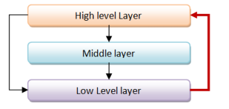
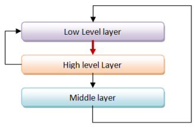
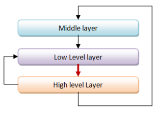

*One of three related posts on [module organization](../posts/recipe-part3/index.md) and [cyclic dependencies](../posts/removing-cyclic-dependencies/index.md).*

One of the most common complaints about F# is that it requires code to be in *dependency order*. That is, you cannot use forward references to code that hasn't been seen by the compiler yet.  

Here's a typical example:

> "The order of .fs files makes it hard to compile... My F# application is just over 50 lines of code, but it's already more work than it's worth to compile even the tiniest non-trivial application. Is there a way to make the F# compiler more like the C# compiler, so that it's not so tightly coupled to the order that files are passed to the compiler?" [[fpish.net]](http://fpish.net/topic/None/57578) 

and another:

> "After trying to build a slightly above-toy-size project in F#, I came to the conclusion that with current tools it would be quite difficult to maintain a project of even moderate complexity." [[www.ikriv.com]](http://www.ikriv.com/blog/?p=28) 

and another:

> "F# compiler [is] too linear. The F# compiler should handle all type resolution matters automatically, independent of declaration order" [[www.sturmnet.org]](http://www.sturmnet.org/blog/2008/05/20/f-compiler-considered-too-linear) 

and one more:

> "The topic of annoying (and IMHO unnecessary) limitations of the F# project system was already discussed on this forum. I am talking about the way compilation order is controlled" [[fpish.net]](http://fpish.net/topic/Some/0/59219) 

Well, these complaints are unfounded. You most certainly can build and maintain large projects using F#. The F# compiler and the core library are two obvious examples.

In fact, most of these problems boil down to "why can't F# be like C#".  If you are coming from C#, you are used to having the compiler connect everything automatically. Having to deal with dependency relationships explicitly is very annoying -- old-fashioned and regressive, even.  

The aim of this post is to explain (a) why dependency management is important, and (b) some techniques that can help you deal with it.

## Dependencies are bad things...

We all know that dependencies are the bane of our existence. Assembly dependencies, configuration dependencies, database dependencies, network dependencies -- there's always something.

So we developers, as a profession, tend to put a lot of effort into making dependencies more manageable. This goal manifests itself in many disparate ways: the [interface segregation principle](http://en.wikipedia.org/wiki/Interface_segregation_principle), inversion of control and [dependency injection](http://en.wikipedia.org/wiki/Dependency_inversion_principle); package management with NuGet; configuration management with puppet/chef; and so on. In some sense all these approaches are trying to reduce the number of things we have to be aware of, and the number of things that can break.

This is not a new problem, of course. A large part of the classic book "[Large-Scale C++ Software Design](http://www.amazon.com/Large-Scale-Software-Design-John-Lakos/dp/0201633620)" is devoted to dependency management. As John Lakos, the author, put it:

> "The maintenance cost of a subsystem can be reduced significantly by avoiding unnecessary dependencies among components"

The key word here is "unnecessary". What is an "unnecessary" dependency?  It depends, of course. But one particular kind of dependency is almost always unnecessary -- a **circular dependency**.

## ... and circular dependencies are evil

To understand why circular dependencies are evil, let's revisit what we mean by a "component".

Components are Good Things. Whether you think of them as packages, assemblies, modules, classes or whatever, their primary purpose is to break up large amounts of code into smaller and more manageable pieces.  In other words, we are applying a divide and conquer approach to the problem of software development.

But in order to be useful for maintenance, deployment, or whatever, a component shouldn't just be a random collection of stuff. It should (of course) group only *related code* together. 

In an ideal world, each component would thus be completely independent of any others. But generally (of course), some dependencies are always necessary.  

But, now that we have components with *dependencies*, we need a way to manage these dependencies. One standard way to do this is with the "layering" principle. We can have "high level" layers and "low level" layers, and the critical rule is: *each layer should depend only on layers below it, and never on a layer above it*.

You are very familiar with this, I'm sure. Here's a diagram of some simple layers:

But now what happens when you introduce a dependency from the bottom layer to the top layer, like this?

By having a dependency from the bottom to the top, we have introduced the evil "circular dependency". 

Why is it evil? Because *any* alternative layering method is now valid! 

For example, we could put the bottom layer on top instead, like this:

From a logical point of view, this alternative layering is just the same as the original layering. 

Or how about we put the middle layer on top?

Something has gone badly wrong! It's clear that we've really messed things up. 

In fact, as soon as you have any kind of circular dependency between components, the *only* thing you can do is to put them *all* into the *same* layer.  

In other words, the circular dependency has completely destroyed our "divide and conquer" approach, the whole reason for having components in the first place.  Rather than having three components, we now have just one "super component", which is three times bigger and more complicated than it needed to be. 

And that's why circular dependencies are evil.

*For more on this subject, see this [StackOverflow answer](http://stackoverflow.com/a/1948636/1136133) and [this article about layering](http://codebetter.com/patricksmacchia/2008/02/10/layering-the-level-metric-and-the-discourse-of-method/) by Patrick Smacchia (of NDepend).*

## Circular dependencies in the real world

Let's start by looking at circular dependencies between .NET assemblies. Here are some war stories from Brian McNamara (my emphasis):

> The .Net Framework 2.0 has this problem in spades; System.dll, System.Configuration.dll, and System.Xml.dll are all hopelessly entangled with one another. This manifests in a variety of ugly ways. For example, I found a simple [bug] in the VS debugger that effectively crashes the debuggee when hitting a breakpoint while trying to loads symbols, caused by the circular dependencies among these assemblies. Another story: a friend of mine was a developer on the initial versions of Silverlight and was tasked with trying to trim down these three assemblies, and the first arduous task was trying to untangle the circular dependencies. **"Mutual recursion for free" is very convenient on a small scale, but it will destroy you on a large scale.**

> VS2008 shipped a week later than planned, because VS2008 had a dependency on SQL server, and SQL server had a dependency on VS, and whoops! in the end they couldn't produce a full product version where everything had the same build number, and had to scramble to make it work.  [[fpish.net]](http://fpish.net/topic/None/59219#comment-70220)

So there is plenty of evidence that circular dependencies between assemblies are bad.  In fact, circular dependencies between assemblies are considered bad enough that Visual Studio won't even let you create them!

You might say, "Yes, I can understand why circular dependencies are bad for assemblies, but why bother for code inside an assembly?"

Well, for exactly the same reasons!  Layering allows better partitioning, easier testing and cleaner refactoring.  You can see what I mean in a [related post on dependency cycles "in the wild"](../posts/cycles-and-modularity-in-the-wild/index.md) where I compare C# projects and F# projects. The dependencies in the F# projects are a lot less spaghetti-like.

Another quote from Brian's (excellent) comment:

> I'm evangelizing an unpopular position here, but my experience is that everything in the world is better when you're forced to consider and manage "dependency order among software components" at every level of the system. The specific UI/tooling for F# may not yet be ideal, but I think the principle is right. This is a burden you want. It *is* more work. "Unit testing" is also more work, but we've gotten to the point where the consensus is that work is "worth it" in that it saves you time in the long run. I feel the same way about 'ordering'. There are dependencies among the classes and methods in your system. You ignore those dependencies at your own peril. A system that forces you to consider this dependency graph (roughly, the topological sort of components) is likely to steer you into developing software with cleaner architectures, better system layering, and fewer needless dependencies.

## Detecting and removing circular dependencies 

Ok, we're agreed that circular dependencies are bad. So how do we detect them and then get rid of them?

Let's start with detection. There are a number of tools to help you detect circular dependencies in your code.

* If you're using C#, you will need a tool like the invaluable [NDepend](http://www.ndepend.com/features.aspx#DependencyCycle).
* And if you are using Java, there are equivalent tools such as [JDepend](http://www.clarkware.com/software/JDepend.html#cycles).
* But if you are using F#, you're in luck! You get circular dependency detection for free!

"Very funny," you might say, "I already know about F#'s circular dependency prohibition -- it's driving me nuts! What can I do to fix the problem and make the compiler happy?"

For that, you'll need to read the [next post](../posts/removing-cyclic-dependencies/index.md)...

