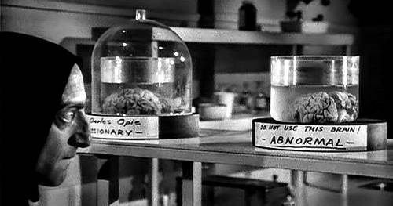
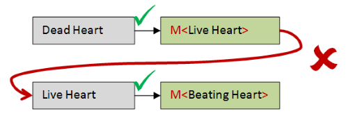
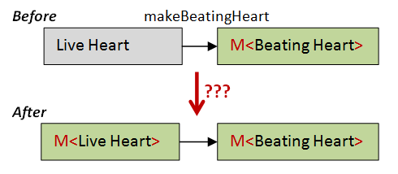
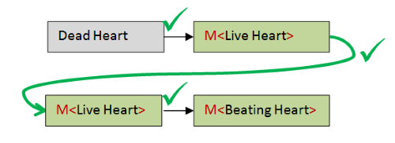
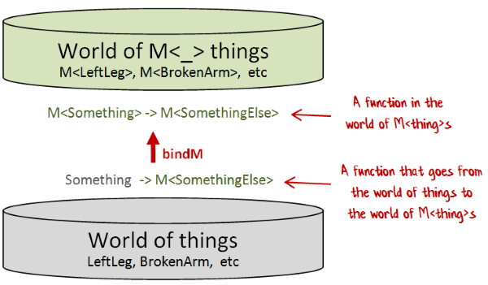
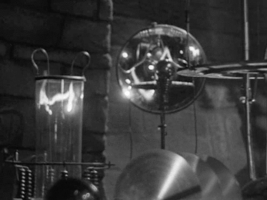

*UPDATE: [Slides and video from my talk on this topic](http://fsharpforfunandprofit.com/monadster/)*

*Warning! This post contains gruesome topics, strained analogies, discussion of monads*

Welcome to the gripping tale of Dr Frankenfunctor and the Monadster!

We saw [in the previous installment](../posts/monadster.md) how Dr Frankenfunctor created life out of dead body parts using "Monadster part generators" (or "M"s for short),
that would, on being supplied with some vital force, return a live body part.

We also saw how the leg and arms of the creature were created, and how these M-values could be processed
and combined using `mapM` (for the broken arm) and `map2M` (for the arm in two parts).

In this second installment, we'll look at the other techniques Dr Frankenfunctor used to create the head, the heart, and the complete body.

## The Head

First, the head.

Just like the right arm, the head is composed of two parts, a brain and a skull.

Dr Frankenfunctor started by defining the dead brain and skull:

```
type DeadBrain = DeadBrain of Label 
type Skull = Skull of Label 
```

Unlike the two-part right arm, only the brain needs to become alive.
The skull can be used as is and does not need to be transformed before being used in a live head.

```
type LiveBrain = LiveBrain of Label * VitalForce

type LiveHead = {
    brain : LiveBrain
    skull : Skull // not live
    }
```

The live brain is combined with the skull to make a live head using a `headSurgery` function, analogous to the `armSurgery` we had earlier.

```
let headSurgery brain skull =
    {brain=brain; skull=skull}
```

Now we are ready to create a live head -- but how should we do it?

It would be great if we could reuse `map2M`, but there's a catch -- for `map2M` to work, it needs a skull wrapped in a `M`. 


But the skull doesn't need to become alive or use vital force, so we will need to create a special function that converts a `Skull` to a `M<Skull>`.

We can use the same approach as we did before:

* create a inner function that takes a vitalForce parameter
* in this case, we leave the vitalForce untouched
* from the inner function return the original skull and the untouched vitalForce 
* wrap the inner function in an "M" and return it

Here's the code:

```
let wrapSkullInM skull = 
    let becomeAlive vitalForce = 
        skull, vitalForce 
    M becomeAlive
```

But the signature of `wrapSkullInM` is quite interesting. 

```
val wrapSkullInM : 'a -> M<'a>
```

No mention of skulls anywhere!  

### Introducing returnM

We've created a completely generic function that will turn anything into an `M`.  So let's rename it.
I'm going to call it `returnM`, but in other contexts it might be called `pure` or `unit`.

```
let returnM x = 
    let becomeAlive vitalForce = 
        x, vitalForce 
    M becomeAlive
```

### Testing the head

Let's put this into action.

First, we need to define how to create a live brain.

```
let makeLiveBrain (DeadBrain label) = 
    let becomeAlive vitalForce = 
        let oneUnit, remainingVitalForce = getVitalForce vitalForce 
        let liveBrain = LiveBrain (label,oneUnit)
        liveBrain, remainingVitalForce    
    M becomeAlive
```

Next we obtain a dead brain and skull:

```
let deadBrain = DeadBrain "Abby Normal"
let skull = Skull "Yorick"
```

*By the way, how this particular dead brain was obtained is an [interesting story](https://en.wikipedia.org/wiki/Young_Frankenstein) that I don't have time to go into right now.*



Next we build the "M" versions from the dead parts:

```
let liveBrainM = makeLiveBrain deadBrain
let skullM = returnM skull
```

And combine the parts using `map2M`:

```
let headSurgeryM = map2M headSurgery
let headM = headSurgeryM liveBrainM skullM
```

Once again, we can do all these things up front, before the lightning strikes.

When the vital force is available, we can run `headM` with the vital force...

```
let vf = {units = 10}

let liveHead, remainingFromHead = runM headM vf
```

...and we get this result:

```
val liveHead : LiveHead = 
    {brain = LiveBrain ("Abby normal",{units = 1;});
    skull = Skull "Yorick";}
    
val remainingFromHead : VitalForce = 
    {units = 9;}
```

A live head, composed of two subcomponents, just as required.  

Also note that the remaining vital force is just nine, as the skull did not use up any units.

## The Beating Heart

There is one more component we need, and that is a heart.

First, we have a dead heart and a live heart defined in the usual way:

```
type DeadHeart = DeadHeart of Label 
type LiveHeart = LiveHeart of Label * VitalForce
```

But the creature needs more than a live heart -- it needs a *beating heart*.
A beating heart is constructed from a live heart and some more vital force, like this:

```
type BeatingHeart = BeatingHeart of LiveHeart * VitalForce
```

The code that creates a live heart is very similar to the previous examples:

```
let makeLiveHeart (DeadHeart label) = 
    let becomeAlive vitalForce = 
        let oneUnit, remainingVitalForce = getVitalForce vitalForce 
        let liveHeart = LiveHeart (label,oneUnit)
        liveHeart, remainingVitalForce    
    M becomeAlive
```

The code that creates a beating heart is also very similar. It takes a live heart as a parameter, uses up another unit of vital force,
and returns the beating heart and the remaining vital force.

```
let makeBeatingHeart liveHeart = 

    let becomeAlive vitalForce = 
        let oneUnit, remainingVitalForce = getVitalForce vitalForce 
        let beatingHeart = BeatingHeart (liveHeart, oneUnit)
        beatingHeart, remainingVitalForce    
    M becomeAlive
```

If we look at the signatures for these functions, we see that they are very similar; both of the form `Something -> M<SomethingElse>`.

```
val makeLiveHeart : DeadHeart -> M<LiveHeart>
val makeBeatingHeart : LiveHeart -> M<BeatingHeart>
```

### Chaining together M-returning functions

We start with a dead heart, and we need to get a beating heat


But we don't have the tools to do this directly.

We have a function that turns a `DeadHeart` into a `M<LiveHeart>`, and we have a function that turns a `LiveHeart` into a `M<BeatingHeart>`.

But the output of the first is not compatible with the input of the second, so we can't glue them together. 



What we want then, is a function that, given a `M<LiveHeart>` as input, can convert it to a `M<BeatingHeart>`.

And furthermore, we want to build it from the `makeBeatingHeart` function we already have.



Here's a first attempt, using the same pattern we've used many times before:

```
let makeBeatingHeartFromLiveHeartM liveHeartM = 

    let becomeAlive vitalForce = 
        // extract the liveHeart from liveHeartM 
        let liveHeart, remainingVitalForce = runM liveHeartM vitalForce 

        // use the liveHeart to create a beatingHeartM
        let beatingHeartM = makeBeatingHeart liveHeart

        // what goes here?

        // return a beatingHeart and remaining vital force    
        beatingHeart, remainingVitalForce    

    M becomeAlive 
```

But what goes in the middle? How can we get a beating heart from a `beatingHeartM`?  The answer is to run it with some vital force
(which we happen to have on hand, because we are in the middle of the `becomeAlive` function).  

What vital force though? It should be the remaining vital force after getting the `liveHeart`.

So the final version looks like this:

```
let makeBeatingHeartFromLiveHeartM liveHeartM = 

    let becomeAlive vitalForce = 
        // extract the liveHeart from liveHeartM 
        let liveHeart, remainingVitalForce = runM liveHeartM vitalForce 

        // use the liveHeart to create a beatingHeartM
        let beatingHeartM = makeBeatingHeart liveHeart

        // run beatingHeartM to get a beatingHeart
        let beatingHeart, remainingVitalForce2 = runM beatingHeartM remainingVitalForce 

        // return a beatingHeart and remaining vital force    
        beatingHeart, remainingVitalForce2    

    // wrap the inner function and return it        
    M becomeAlive
```

Notice that we return `remainingVitalForce2` at the end, the remainder after both steps are run.

If we look at the signature for this function, it is:

```
M<LiveHeart> -> M<BeatingHeart>
```

which is just what we wanted!

### Introducing bindM

Once again, we can make this function generic by passing in a function parameter rather than hardcoding `makeBeatingHeart`.

I'll call it `bindM`. Here's the code:

```
let bindM f bodyPartM = 
    let becomeAlive vitalForce = 
        let bodyPart, remainingVitalForce = runM bodyPartM vitalForce 
        let newBodyPartM = f bodyPart 
        let newBodyPart, remainingVitalForce2 = runM newBodyPartM remainingVitalForce 
        newBodyPart, remainingVitalForce2    
    M becomeAlive
```

and the signature is:

```
f:('a -> M<'b>) -> M<'a> -> M<'b>
```

In other words, given any function `Something -> M<SomethingElse>`, I can convert it to a function `M<Something> -> M<SomethingElse>` that has an `M` as input and output.

By the way, functions with a signature like `Something -> M<SomethingElse>` are often called *monadic* functions.

Anyway, once you understand what is going on in `bindM`, a slightly shorter version can be implemented like this:

```
let bindM f bodyPartM = 
    let becomeAlive vitalForce = 
        let bodyPart, remainingVitalForce = runM bodyPartM vitalForce 
        runM (f bodyPart) remainingVitalForce 
    M becomeAlive
```

So finally, we have a way of creating a function, that given a `DeadHeart`, creates a `M<BeatingHeart>`.



Here's the code:

```
// create a dead heart
let deadHeart = DeadHeart "Anne"

// create a live heart generator (M<LiveHeart>)
let liveHeartM = makeLiveHeart deadHeart

// create a beating heart generator (M<BeatingHeart>)
// from liveHeartM and the makeBeatingHeart function
let beatingHeartM = bindM makeBeatingHeart liveHeartM 
```

There are a lot of intermediate values in there, and it can be made simpler by using piping, like this:

```
let beatingHeartM = 
   DeadHeart "Anne"
   |> makeLiveHeart 
   |> bindM makeBeatingHeart 
```

### The importance of bind

One way of thinking about `bindM` is that it is another "function converter", just like `mapM`.
That is, given any "M-returning" function, it converts it to a function where the input and output are both `M`s.



Just like `map`, `bind` appears in many other contexts.

For example, `Option.bind` transforms a option-generating function (`'a -> 'b option`) into a function whose inputs and outputs are options.
Similarly, `List.bind` transforms a list-generating function (`'a -> 'b list`) into a function whose inputs and outputs are lists. 

And I discuss yet another version of bind at length in my talk on [functional error handling](http://fsharpforfunandprofit.com/rop/).

The reason that bind is so important is that "M-returning" functions crop up a lot, and they cannot be chained together easily because the output of one step does not match the input
of the the next step.

By using `bindM`, we can convert each step into a function where the input and output are both `M`s, and then they *can* be chained together.


### Testing the beating heart

As always, we construct the recipe ahead of time, in this case, to make a `BeatingHeart`.

```
let beatingHeartM =
    DeadHeart "Anne" 
    |> makeLiveHeart 
    |> bindM makeBeatingHeart 
```

When the vital force is available, we can run `beatingHeartM` with the vital force...

```
let vf = {units = 10}

let beatingHeart, remainingFromHeart = runM beatingHeartM vf
```

...and we get this result:

```
val beatingHeart : BeatingHeart = 
    BeatingHeart (LiveHeart ("Anne",{units = 1;}),{units = 1;})

val remainingFromHeart : VitalForce = 
    {units = 8;}
```

Note that the remaining vital force is eight units, as we used up two units doing two steps.

## The Whole Body

Finally, we have all the parts we need to assemble a complete body.

Here is Dr Frankenfunctor's definition of a live body:

```
type LiveBody = {
    leftLeg: LiveLeftLeg
    rightLeg : LiveLeftLeg
    leftArm : LiveLeftArm
    rightArm : LiveRightArm
    head : LiveHead
    heart : BeatingHeart
    }
```

You can see that it uses all the subcomponents that we have already developed.

### Two left feet

Because there was no right leg available, Dr Frankenfunctor decided to take a short cut and use *two* left legs in the body, hoping that no one would notice.

The result of this was that the creature had two left feet, [which is not always a handicap](https://www.youtube.com/watch?v=DC_PACr5cT8&t=55), and indeed,
the creature not only overcame this disadvantage but became a creditable dancer, as can be seen in this rare footage:

<iframe width="854" height="510" src="https://www.youtube.com/embed/w1FLZPFI3jc" frameborder="0" allowfullscreen></iframe>

### Assembling the subcomponents

The `LiveBody` type has six fields. How can we construct it from the various `M<BodyPart>`s that we have?

One way would be to repeat the technique that we used with `mapM` and `map2M`.  We could create a `map3M` and `map4M` and so on.

For example, `map3M` could be defined like this:

```
let map3M f m1 m2 m3 =
    let becomeAlive vitalForce = 
        let v1,remainingVitalForce = runM m1 vitalForce 
        let v2,remainingVitalForce2 = runM m2 remainingVitalForce  
        let v3,remainingVitalForce3 = runM m3 remainingVitalForce2  
        let v4 = f v1 v2 v3
        v4, remainingVitalForce3    
    M becomeAlive  
```

But that gets tedious quite quickly. Is there a better way? 

Why, yes there is!

To understand it, remember that record types like `LiveBody` have to be built all-or-nothing,
but *functions* can be assembled step by step, thanks to the magic of currying and partial application.

So if we have a six parameter function that creates a `LiveBody`, like this:

```
val createBody : 
    leftLeg:LiveLeftLeg ->
    rightLeg:LiveLeftLeg ->
    leftArm:LiveLeftArm ->
    rightArm:LiveRightArm ->
    head:LiveHead -> 
    beatingHeart:BeatingHeart -> 
    LiveBody
```

we can actually think of it as a *one* parameter function that returns a five parameter function, like this:

```
val createBody : 
    leftLeg:LiveLeftLeg -> (five param function) 
```

and then when we apply the function to the first parameter ("leftLeg") we get back that five parameter function:

```
(six param function) apply (first parameter) returns (five param function)
```

where the five parameter function has the signature:

```
    rightLeg:LiveLeftLeg ->
    leftArm:LiveLeftArm ->
    rightArm:LiveRightArm ->
    head:LiveHead -> 
    beatingHeart:BeatingHeart -> 
    LiveBody
```

This five parameter function can in turn be thought of as a one parameter function that returns a four parameter function:

```
    rightLeg:LiveLeftLeg -> (four parameter function)
```

Again, we can apply a first parameter ("rightLeg") and get back that four parameter function:

```
(five param function) apply (first parameter) returns (four param function)
```

where the four parameter function has the signature:

```
    leftArm:LiveLeftArm ->
    rightArm:LiveRightArm ->
    head:LiveHead -> 
    beatingHeart:BeatingHeart -> 
    LiveBody
```

And so on and so on, until eventually we get a function with one parameter. The function will have the signature `BeatingHeart -> LiveBody`.

When we apply the final parameter ("beatingHeart") then we get back our completed `LiveBody`.

We can use this trick for M-things as well!

We start with the six parameter function wrapped in an M, and an M<LiveLeftLeg> parameter. 

Let's assume there is some way to "apply" the M-function to the M-parameter. We should get back a five parameter function wrapped in an `M`.

```
// normal version
(six param function) apply (first parameter) returns (five param function)

// M-world version
M<six param function> applyM M<first parameter> returns M<five param function>
```

And then doing that again, we can apply the next M-parameter

```
// normal version
(five param function) apply (first parameter) returns (four param function)

// M-world version
M<five param function> applyM M<first parameter> returns M<four param function>
```

and so on, applying the parameters one by one until we get the final result.

### Introducing applyM

This `applyM` function will have two parameters then, a function wrapped in an M, and a parameter wrapped in an M.
The output will be the result of the function wrapped in an M.

Here's the implementation:

```
let applyM mf mx =
    let becomeAlive vitalForce = 
        let f,remainingVitalForce = runM mf vitalForce 
        let x,remainingVitalForce2 = runM mx remainingVitalForce  
        let y = f x
        y, remainingVitalForce2    
    M becomeAlive  
```

As you can see it is quite similar to `map2M`, except that the "f" comes from unwrapping the first parameter itself.

Let's try it out!

First we need our six parameter function:

```
let createBody leftLeg rightLeg leftArm rightArm head beatingHeart =
    {
    leftLeg = leftLeg
    rightLeg = rightLeg
    leftArm = leftArm
    rightArm = rightArm
    head = head
    heart = beatingHeart 
    }
```

And we're going to need to clone the left leg to use it for the right leg:

```
let rightLegM = leftLegM
```

Next, we need to wrap this `createBody` function in an `M`. How can we do that? 

With the `returnM` function we defined earlier for skull, of course!

So putting it together, we have this code:

```
// move createBody to M-world -- a six parameter function wrapped in an M
let fSixParamM = returnM createBody           

// apply first M-param to get a five parameter function wrapped in an M
let fFiveParamM = applyM fSixParamM leftLegM   

// apply second M-param to get a four parameter function wrapped in an M
let fFourParamM = applyM fFiveParamM rightLegM 

// etc
let fThreeParamM = applyM fFourParamM leftArmM
let fTwoParamM = applyM fThreeParamM rightArmM
let fOneParamM = applyM fTwoParamM headM 

// after last application, the result is a M<LiveBody>
let bodyM = applyM fOneParamM beatingHeartM   
```

It works! The result is a `M<LiveBody>` just as we want. 

But that code sure is ugly!  What can we do to make it look nicer?

One trick is to turn `applyM` into an infix operation, just like normal function application. The operator used for this is commonly written `<*>`.

```
let (<*>) = applyM
```

With this in place, we can rewite the above code as:

```
let bodyM = 
    returnM createBody 
    <*> leftLegM
    <*> rightLegM
    <*> leftArmM
    <*> rightArmM
    <*> headM 
    <*> beatingHeartM
```

which is much nicer!

Another trick is to notice that the `returnM` followed by `applyM` is the same as `mapM`. So if we create an infix operator for `mapM` too...

```
let (<!>) = mapM
```

...we can get rid of the `returnM` as well and write the code like this:

```
let bodyM = 
    createBody 
    <!> leftLegM
    <*> rightLegM
    <*> leftArmM
    <*> rightArmM
    <*> headM 
    <*> beatingHeartM
```

What's nice about this is that it reads almost as if you were just calling the original function (once you get used to the symbols!)

### Testing the whole body

As always, we want to construct the recipe ahead of time. In this case, we have already created the `bodyM` that will give us a complete `LiveBody` when the vital force arrives.

Now all we have to do is wait for lightning to strike and charge the machinery that generates the vital force!

<br><sub><a href="http://misfitdaydream.blogspot.co.uk/2012/10/frankenstein-1931.html">Source: Misfit Robot Daydream</a></sub>

Here it comes --  the vital force is available! Quickly we run `bodyM ` in the usual way...

```
let vf = {units = 10}

let liveBody, remainingFromBody = runM bodyM vf
```

...and we get this result:

```
val liveBody : LiveBody =
  {leftLeg = LiveLeftLeg ("Boris",{units = 1;});
   rightLeg = LiveLeftLeg ("Boris",{units = 1;});
   leftArm = LiveLeftArm ("Victor",{units = 1;});
   rightArm = {lowerArm = LiveRightLowerArm ("Tom",{units = 1;});
               upperArm = LiveRightUpperArm ("Jerry",{units = 1;});};
   head = {brain = LiveBrain ("Abby Normal",{units = 1;});
           skull = Skull "Yorick";};
   heart = BeatingHeart (LiveHeart ("Anne",{units = 1;}),{units = 1;});}

val remainingFromBody : VitalForce = {units = 2;}
```

It's alive! We have successfully reproduced Dr Frankenfunctor's work!

Note that the body contains all the correct subcomponents,
and that the remaining vital force has been correctly reduced to two units, as we used up eight units creating the body.

## Summary

In this post, we extended our repertoire of manipulation techniques to include:

* `returnM` for the skull
* `bindM` for the beating heart
* `applyM` to assemble the whole body

*The code samples used in this post are [available on GitHub](https://gist.github.com/swlaschin/54489d9586402e5b1e8a)*.

## Next time

In [the final installment](../posts/monadster-3.md), we'll refactor the code and review all the techniques used.

